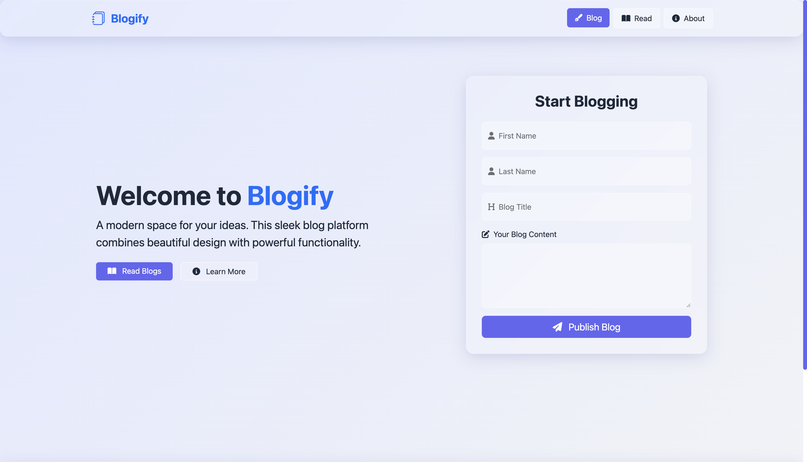
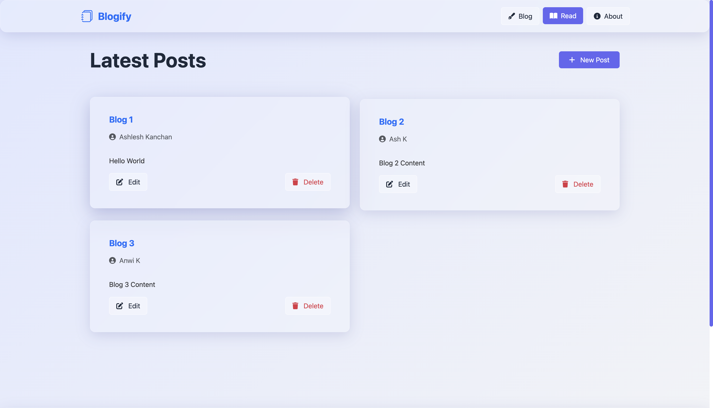
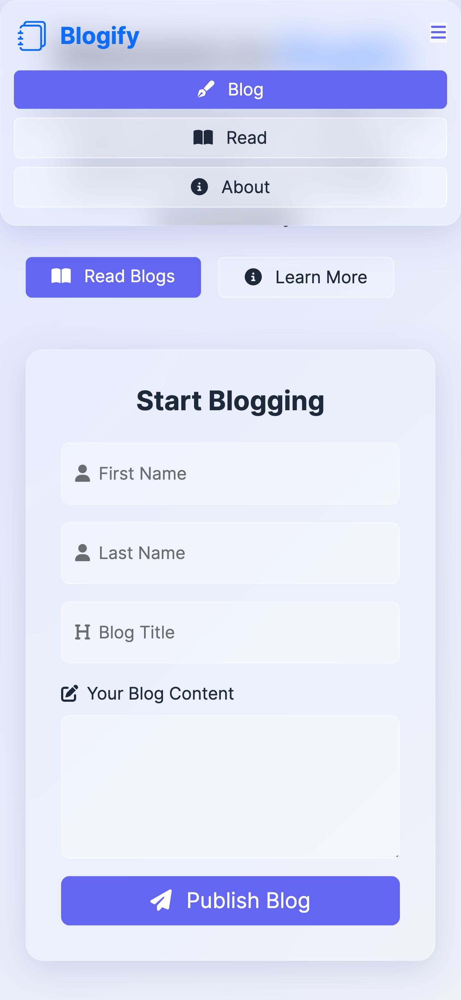
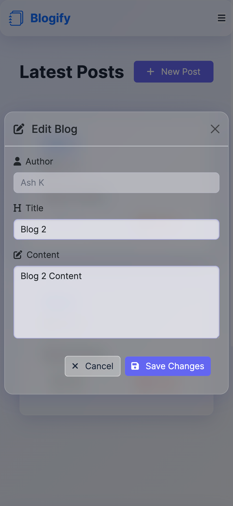
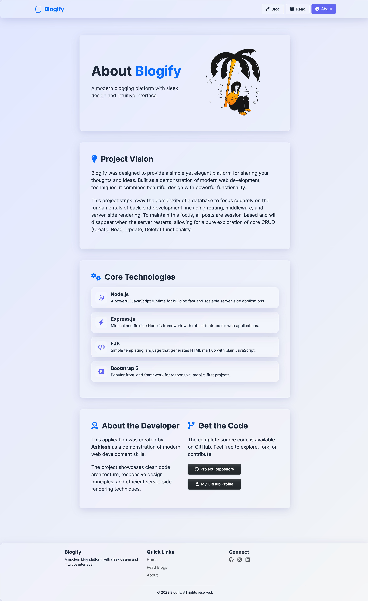

# Blogify - Modern Blog Web Application

A sleek, responsive blog platform built with Node.js, Express.js, and EJS. Create, read, edit, and delete blog posts with a beautiful glass-morphism design that works seamlessly across all devices.

**Note:** This is a session-based application with no database integration. All posts are stored in memory and will be lost when the server restarts, making it perfect for learning and demonstration purposes.


## Features

- **Create Posts**: Write and publish new blog entries with author information
- **Read Posts**: Browse through all published blog posts
- **Edit Posts**: Modify existing blog content and titles
- **Delete Posts**: Remove unwanted posts with confirmation
- **Modern UI**: Beautiful glass-morphism design with smooth animations
- **Responsive**: Optimized for desktop, tablet, and mobile devices
- **Fast**: Lightweight and performant with minimal dependencies

## Live Demo

Experience Blogify in action: [Demo Link Coming Soon]

## Screenshots

<table>
  <tr>
    <td align="center" valign="top">
      <strong>Home Page</strong><br>
      <br>
      <em>Create new blog posts with author information and content</em>
    </td>
    <td align="center" valign="top">
      <strong>Read Page with Blog Posts</strong><br>
      <br>
      <em>Browse through all published blog posts with edit and delete options</em>
    </td>
  </tr>
</table>
<table>
  <tr>
    <td align="center" valign="top">
      <strong>Phone View</strong><br>
      <br>
      <em>Home Page with Navbar on phone Dimensions</em>
    </td>
    <td align="center" valign="top">
      <strong>Edit Modal</strong><br>
      <br>
      <em>In-place editing of blog posts through intuitive modal dialogs</em>
    </td>
     <td align="center" valign="top">
      <strong>Delete Confirmation Modal</strong><br>
      <br>
      <em>Safe deletion with confirmation warnings and post preview</em>
    </td>
  </tr>
  <tr>
</table>
<table>
    <td colspan="3" align="center">
      <strong>About Page</strong><br>
    </td>
  </tr>
</table>



## Tech Stack

- **Backend**: Node.js, Express.js
- **Template Engine**: EJS (Embedded JavaScript)
- **Styling**: Custom CSS with Glass-morphism effects
- **Frontend Framework**: Bootstrap 5 (CDN)
- **Icons**: Font Awesome 6
- **Development**: Modern ES6+ JavaScript

## Prerequisites

- Node.js (version 18 or higher)
- npm (comes with Node.js)

## Installation & Setup

1. **Clone the repository**
   ```bash
   git clone https://github.com/Ash-the-k/BlogWebApp.git
   cd BlogWebApp
   ```

2. **Install dependencies**
   ```bash
   npm install
   ```

3. **Start the application**
   ```bash
   node index.js
   ```

4. **Open your browser**
   Navigate to `http://localhost:3000`

## Project Structure

```
BlogWebApp/
├── public/
│   └── styles/
│       └── main.css          # Custom glass-morphism styles
├── views/
│   ├── partials/
│   │   ├── header.ejs        # Navigation and header
│   │   ├── footer.ejs        # Footer and scripts
│   │   ├── editModal.ejs     # Edit post modal
│   │   └── deleteModal.ejs   # Delete confirmation modal
│   ├── index.ejs             # Home page with post creation form
│   ├── read.ejs              # Blog posts listing page
│   └── about.ejs             # About page with project details
├── index.js                  # Main server file
└── package.json              # Project dependencies
```

## Key Features Implementation

### Post Management
- **Create**: Form-based post creation with author details
- **Read**: Dynamic rendering of all posts with EJS
- **Update**: In-place editing through modal dialogs
- **Delete**: Confirmation-based deletion with safety warnings

### User Experience
- **Glass-morphism Design**: Modern, translucent UI elements
- **Responsive Layout**: Mobile-first design approach
- **Smooth Animations**: Hover effects and transitions
- **Intuitive Navigation**: Clear call-to-action buttons

### Technical Features
- **Server-side Rendering**: Fast page loads with EJS
- **Form Handling**: Secure POST request processing
- **Static File Serving**: Efficient CSS and asset deliverya
- **Session Management**: In-memory data storage (demo purposes)

## Design Philosophy

Blogify embraces modern design principles with:
- **Glass-morphism**: Translucent, frosted glass effects
- **Minimalism**: Clean, uncluttered interface
- **Accessibility**: High contrast and readable typography
- **Responsiveness**: Seamless experience across all devices

## Responsive Design

The application is built with a mobile-first approach:
- **Mobile**: Optimized touch interactions and compact layouts
- **Tablet**: Balanced spacing and navigation
- **Desktop**: Full-featured experience with hover effects


## Limitations

### Current Limitations
- **No Database**: Posts don't persist between server restarts
- **No Authentication**: Single-user application
- **No Image Uploads**: Text-only blog posts


## Testing

Test the application by:
1. Creating multiple blog posts
2. Editing post content and titles
3. Deleting posts with confirmation
4. Testing responsive design on different screen sizes
5. Verifying form validation and error handling

## Contributing

Contributions are welcome! Please feel free to submit a Pull Request.

## License

This project is licensed under the MIT License - see the [LICENSE](LICENSE) file for details.

## Developer

**Ashlesh Kanchan**

[](https://github.com/Ash-the-k)
[](https://www.linkedin.com/in/ashlesh-kanchan/)
[](https://www.instagram.com/ash.the.k/)

## Credits & Resources

- **Dr. Angela Yu** - The Complete Full-Stack Web Development Bootcamp
- **Bootstrap Team** - Responsive CSS framework
- **Font Awesome** - Icon library
- **EJS Community** - Template engine

## Learning Outcomes

This project demonstrates:
- **Node.js & Express.js**: Server-side development
- **EJS Templating**: Dynamic HTML generation
- **CSS Animations**: Modern UI effects
- **Responsive Design**: Mobile-first development
- **Form Handling**: User input processing
- **Modal Interactions**: JavaScript-based UI components

---

**Star this repository if you found it helpful!**

---

*Built with ❤️ as part of "The Complete Full-Stack Web Development Bootcamp" by Dr. Angela Yu*
